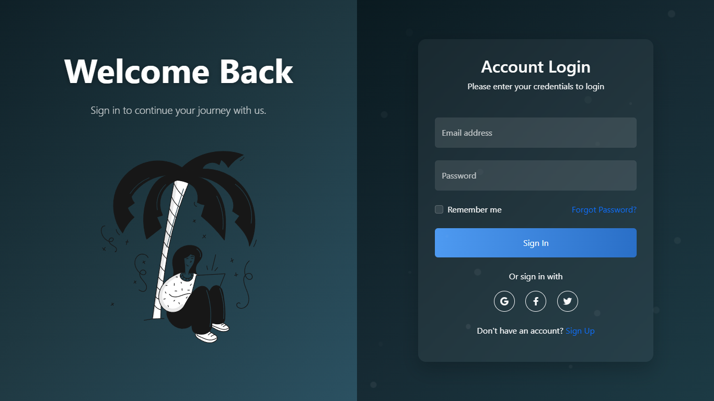

```markdown
# Responsive Login Page with Dark Blue-Black Gradient

A modern, responsive login page with a dark blue-black gradient background, featuring a hero section and an animated login form. This project uses Bootstrap 5, custom CSS, and JavaScript to create a visually appealing and fully responsive login experience.

## Features

- **Responsive Design**: Works seamlessly on mobile, tablet, and desktop devices
- **Dark Mode**: Beautiful dark blue-black gradient background with a modern aesthetic
- **Split Layout**: Hero section with illustration on the left, login form on the right
- **Animations**: Smooth fade-in and transition animations for a polished user experience
- **Floating Particles**: Subtle animated background particles for visual interest
- **Form Validation**: Basic client-side validation with animated feedback
- **Social Login Options**: Integration with popular social login providers
- **Accessibility**: Designed with accessibility in mind for all users

## Technologies Used

- **HTML5**: Semantic markup structure
- **CSS3**: Custom styling with modern CSS features
- **Bootstrap 5**: Responsive grid system and UI components
- **JavaScript**: Interactive elements and animations
- **Font Awesome**: Icon library for social media buttons and UI elements


## Installation

1. Clone the repository:
```bash
git clone https://github.com/aleaengineer/login-page.git
```

2. Navigate to the project directory:
```bash
cd login-page
```

3. Open index.html in your browser:
```bash
open index.html
```

No build process or dependencies are required to run this project locally.

## Usage

This login page can be integrated into any web application that requires user authentication. To customize it for your needs:

- Change the branding: Update the hero text and images to match your brand
- Modify the form: Add or remove form fields as needed
- Connect to your backend: Update the form submission logic in script.js to connect to your authentication API
- Customize the styling: Adjust colors, fonts, and other design elements in styles.css

## Responsive Breakpoints

The login page is designed to be responsive across all device sizes with the following breakpoints:

- Extra Small: < 576px (Mobile phones)
- Small: 576px - 767px (Landscape phones)
- Medium: 768px - 991px (Tablets)
- Large: 992px - 1199px (Desktops)
- Extra Large: 1200px - 1399px (Large desktops)
- XXL: ≥ 1400px (Extra large screens)

## Browser Compatibility

- Chrome (latest)
- Firefox (latest)
- Safari (latest)
- Edge (latest)
- Opera (latest)
- Mobile browsers (iOS Safari, Android Chrome)

## Customization Options

### Colors

The main gradient can be customized by changing the following CSS variables in styles.css:

```css
body {
    background: linear-gradient(135deg, #0f2027, #203a43, #2c5364);
}
```

### Animations

Animation timing and effects can be adjusted in the CSS keyframes sections:

```css
@keyframes fadeInUp {
    from {
        opacity: 0;
        transform: translateY(30px);
    }
    to {
        opacity: 1;
        transform: translateY(0);
    }
}
```

### Hero Image

Replace the hero image by changing the image URL in the HTML:

```html

```

## Contributing

Contributions are welcome! Please feel free to submit a Pull Request.

1. Fork the repository
2. Create your feature branch (`git checkout -b feature/amazing-feature`)
3. Commit your changes (`git commit -m 'Add some amazing feature'`)
4. Push to the branch (`git push origin feature/amazing-feature`)
5. Open a Pull Request

## License

This project is licensed under the MIT License - see the LICENSE file for details.

## Acknowledgements

- Bootstrap
- Font Awesome
- Popsy Illustrations
- Unsplash for background image inspiration

Created with ❤️ by Alea Engineer
```
